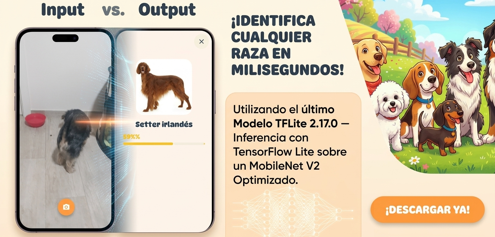
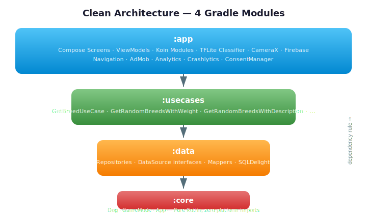

# AdivinaRaza

[](https://github.com/AlvaroQ/AdivinaRaza/actions/workflows/ci.yml)
[](https://play.google.com/store/apps/details?id=com.alvaroquintana.adivinaperro)


[](LICENSE)

---
## On-device AI breed recognition

<p align="center">
  
</p>


## About

**AdivinaRaza** is a **Kotlin Multiplatform** (KMP) app for **Android and iOS** that combines a quiz game about dog breeds with **on-device AI breed recognition** on Android using a TFLite model. Point your camera at any dog and get the breed identified in milliseconds — fully offline, no server required.

The app offers four game modes, a catalogue of 200+ breeds with detailed information (nutrition, hygiene, common diseases, fun facts) and a progression system — built with **Compose Multiplatform**, **Clean Architecture + MVVM** and **Koin** dependency injection.

It is also a production-grade reference for:
- **KMP shared UI** — a single Compose codebase rendering natively on both platforms
- **Edge AI (Android)** — TensorFlow Lite inference running entirely on-device
- **Clean Architecture** across multiplatform modules with Koin DI

---

## Edge AI: Breed Recognition

AdivinaRaza ships with a **MobileNet V2** model optimised and compiled to **TensorFlow Lite**, running inference **100% on-device** with zero network dependency.

<table>
  <tr>
    <td width="50%">

**Key specs:**
| Metric           | Value                    |
| ---------------- | ------------------------ |
| Model            | MobileNet V2 (optimised) |
| Input            | 224×224 RGB              |
| Classes          | 120 breeds               |
| Latency          | ~milliseconds on-device  |
| Network required | No                       |

</td>
    <td width="50%">

**How it works (Android):**
1. Camera captures a photo via CameraX
2. Image is scaled to 224×224 and normalized to `[0, 1]`
3. TFLite interpreter classifies across **120 dog breeds**
4. Top 5 predictions are displayed with confidence percentages
5. Tap any result to see full breed details

</td>
  </tr>
</table>

The `BreedClassifier` interface lives in `commonMain` — Android provides the production implementation:
- **Android** — `AndroidBreedClassifier` loads `breed_model.tflite` via TensorFlow Lite Interpreter

---

## Screenshots

<table align="center">
  <tr>
    <td align="center"><br/><sub>Breed quiz in play</sub></td>
    <td align="center"><br/><sub>Breed catalogue</sub></td>
    <td align="center"><br/><sub>Breed detail & care info</sub></td>
  </tr>
</table>

---

## Tech Stack

| Category             | Technology                                                      | Version           |
| -------------------- | --------------------------------------------------------------- | ----------------- |
| Language             | Kotlin (Multiplatform)                                          | 2.3.20            |
| Platforms            | Android + iOS (iosArm64 + iosSimulatorArm64)                    | —                 |
| Build                | Android Gradle Plugin                                           | 9.1.1             |
| UI                   | Compose Multiplatform + Material3                               | BOM 2026.03.01    |
| Architecture         | Clean Architecture — 4 KMP modules                              | MVVM              |
| State Management     | StateFlow + SharedFlow                                          | Coroutines 1.10.2 |
| Navigation           | Navigation Compose (JetBrains KMP, type-safe)                   | 2.9.2             |
| Dependency Injection | Koin (Multiplatform + Compose)                                  | 4.2.1             |
| On-device AI         | TensorFlow Lite (MobileNet V2 — 120 breeds)                     | 2.17.0            |
| Camera               | CameraX (Android)                                               | —                 |
| Local Persistence    | SQLDelight (Multiplatform)                                      | 2.0.2             |
| Backend              | Firebase (Firestore, Realtime DB, Auth, Analytics, Crashlytics) | BOM 34.12.0       |
| Images               | Coil Compose (+ OkHttp / Ktor network)                          | 3.4.0             |
| Serialization        | kotlinx.serialization                                           | 1.11.0            |
| Monetization         | AdMob (banner + rewarded + interstitial) with UMP consent       | 25.2.0 / 4.0.0    |
| Code Quality         | Detekt                                                          | 1.23.8            |
| Min SDK (Android)    | Android 6.0 (Marshmallow)                                       | API 23            |
| Compile / Target SDK | Android 15                                                      | API 36            |

---

## Architecture

<p align="center">
  
</p>

Four KMP modules, one responsibility each:

- **`app`** — Platform layer: Compose Multiplatform screens, ViewModels, Koin modules, platform-specific implementations (TFLite classifier, CameraX, Firebase, AdMob).
  - `commonMain` — shared UI, navigation, ViewModels, manager interfaces
  - `androidMain` — Android-specific: CameraX, TFLite Interpreter, Firebase SDK, AdMob
  - `iosMain` — iOS-specific: Koin bootstrap, platform stubs
- **`usecases`** — Pure-Kotlin orchestration (`GetBreedUseCase`, `GetRandomBreedsWithWeight`, `GetRandomBreedsWithDescription`, `GetRandomBreedsWithFciGroup`...).
- **`data`** — Repositories, DataSource interfaces, mappers and SQLDelight persistence. Platform-specific drivers via expect/actual (`DriverFactory`, `DocumentSnapshotExt`).
- **`core`** — Pure Kotlin entities: `Dog`, `GameMode`, `App`. Zero platform imports.

```
┌────────────────────────────────────────────────────┐
│  app (Compose Multiplatform)                       │
│  ┌──────────┐  ┌──────────┐  ┌──────────────────┐  │
│  │ commonMain│  │androidMain│  │    iosMain       │  │
│  │ Screens   │  │ CameraX   │  │ Koin bootstrap   │  │
│  │ ViewModels│  │ TFLite    │  │ Platform stubs   │  │
│  │ Navigation│  │ Firebase  │  │                  │  │
│  └──────────┘  └──────────┘  └──────────────────┘  │
├────────────────────────────────────────────────────┤
│  usecases (Pure Kotlin)                            │
├────────────────────────────────────────────────────┤
│  data (Repos · Mappers · SQLDelight)               │
├────────────────────────────────────────────────────┤
│  core (Pure Kotlin entities)                       │
└────────────────────────────────────────────────────┘
```

The dependency rule is enforced by the Gradle module graph. ViewModels expose `StateFlow` for reactive state and `SharedFlow` for one-shot events. Koin wires everything at application start — platform-specific bindings are provided via expect/actual and platform modules.

---

## Features

- **Edge AI Breed Recognition (Android)** — Point the camera at any dog, get the breed identified in milliseconds via on-device TFLite inference. No network required. Top 5 results ranked by confidence with direct navigation to breed details.
- **Gameplay** — 4 game modes (classic breed quiz, weight/height comparison, description guessing, FCI trivia), lives system, stage progression, streak tracking.
- **Breed catalogue** — 200+ breeds with detailed info: origin, temperament, size category, coat type, exercise needs, grooming needs, trainability, barking level, fun facts.
- **Enriched data** — FCI group/section classification, nutrition guides, hygiene tips, common diseases, hair loss ratings, alternative names — sourced per breed in Spanish.
- **Multiplatform** — Single Compose Multiplatform codebase for Android and iOS with platform-specific integrations via expect/actual.
- **Platform** — Material3 light/dark themes, Coil image loading, AdMob (banner + rewarded + interstitial) with UMP consent, Firebase Analytics and Crashlytics.

---

## Design Decisions

Short rationale behind the less-obvious architectural choices — what was gained, what was given up.

- **TFLite on-device over cloud ML API.** Breed recognition runs entirely on-device via a MobileNet V2 model compiled to TensorFlow Lite. Zero latency, zero network dependency, zero per-request cost. *Tradeoff:* model is frozen at 120 breeds — adding new breeds requires retraining and shipping a new model binary.
- **`BreedClassifier` as a common interface.** The classifier contract lives in `commonMain`; Android provides the TFLite implementation. This keeps the recognition ViewModel completely platform-agnostic and ready for future iOS implementation. *Tradeoff:* the interface exists on both platforms but only Android has a functional classifier today.
- **Kotlin Multiplatform with Compose Multiplatform UI.** A single Compose codebase renders natively on both Android and iOS, with platform code only for OS-level integrations (camera, ML inference, Firebase bridges). *Tradeoff:* iOS Compose Multiplatform is still maturing — some components need platform-specific workarounds.
- **SQLDelight as source of truth, Firebase as the seed.** Breed data syncs once from Firebase Realtime Database into SQLDelight; every subsequent query hits SQLite. Fully playable offline, predictable latency, and random-draw queries don't burn Firestore reads. SQLDelight was chosen over Room for KMP compatibility — it generates Kotlin from `.sq` files and works on both Android and iOS. *Tradeoff:* new content isn't real-time — acceptable for a dataset that changes on the order of weeks.
- **MVVM over MVI.** ViewModels expose granular `StateFlow`s per field plus a `SharedFlow` for one-shot events, instead of a single `UiState` reduced from `Intent`s. Screens here have a handful of orthogonal fields and no need for time-travel debugging, so MVI's reducer ceremony would be pure overhead. *Tradeoff:* no single snapshot of "the screen right now" — acceptable because state coherence is local to each ViewModel.
- **Koin over Hilt.** Koin supports KMP natively — no `kapt`/`ksp` in the DI path, shorter incremental builds, and the composable-friendly API works across platforms. *Tradeoff:* runtime graph resolution — missing bindings crash on first use instead of a compile error.
- **Destructive SQLDelight migration.** Schema changes wipe the local database, which simplifies development — no migration scripts to maintain for a local cache that can always be re-seeded from Firebase. *Tradeoff:* a schema change triggers a full re-sync on next launch.
- **Platform implementations in `app`.** Keeps platform SDKs (TFLite, CameraX, AdMob) out of `data` and `core` modules without introducing a fifth `:framework` module. The `data` module holds repositories, mappers and SQLDelight persistence with platform-specific drivers via expect/actual. *Tradeoff:* `app` carries both presentation and platform infrastructure — worth splitting if the project grows significantly.

---

## Testing

<p align="center">
  
</p>

All tests run on the JVM — no device, no emulator. Every push and pull request to `main` runs the full suite through [GitHub Actions](.github/workflows/ci.yml).

| Module     | Tests  | What's covered                                                                                                                                                                |
| ---------- | ------ | ----------------------------------------------------------------------------------------------------------------------------------------------------------------------------- |
| `app`      | 32     | ViewModels (`GameViewModel`, `BiggerSmallerViewModel`, `DescriptionViewModel`, `FciTriviaViewModel`, `InfoViewModel`, `ResultViewModel`, `RecognitionViewModel`)              |
| `usecases` | 14     | `GetBreedById`, `GetBreedList`, `GetRandomBreedsWithWeight`, `GetRandomBreedsWithDescription`, `GetRandomBreedsWithFciGroup`, `GetRandomBreedsWithCare`, `GetAppsRecommended` |
| `data`     | 13     | `BreedByIdRepository`, `AppsRecommendedRepository`, `BreedEsMapper`                                                                                                           |
| **Total**  | **59** | **0 failures · 0 flaky · 0 skipped**                                                                                                                                          |

Stack:

- **JUnit 4** for the test harness
- **MockK 1.14.9** for mocking coroutine APIs and Firebase boundaries
- **Turbine 1.2.1** for asserting `Flow` emissions
- **kotlinx.coroutines.test** for `runTest` and `TestDispatcher`

Run the full suite locally:

```bash
./gradlew test
```

Run a single module:

```bash
./gradlew :core:test
./gradlew :usecases:test
```

---

## Getting Started

### Prerequisites

- **JDK 17+** (required by Android Gradle Plugin 9.x)
- **Android Studio Ladybug (2024.2)** or newer
- **Android SDK 36** installed via SDK Manager
- **Xcode 15+** for iOS builds
- A Firebase project with `google-services.json` (Firestore, Realtime Database, Auth, Analytics and Crashlytics enabled)
- An AdMob account for ad unit IDs (test IDs work out of the box for debug builds)

### Setup

1. Clone the repository:

   ```bash
   git clone https://github.com/AlvaroQ/AdivinaRaza.git
   ```

2. Drop your `google-services.json` in `app/`.

3. Create `app/secrets/secrets.xml` with your AdMob keys:

   ```xml
   <?xml version="1.0" encoding="utf-8"?>
   <resources>
       <string name="admob_id">ca-app-pub-XXXXXXXXXXXXXXXX~XXXXXXXXXX</string>
       <string name="admob_banner_test_id">ca-app-pub-XXXXXXXXXXXXXXXX/XXXXXXXXXX</string>
       <string name="admob_bonificado_test_id">ca-app-pub-XXXXXXXXXXXXXXXX/XXXXXXXXXX</string>
       <string name="admob_banner_game">ca-app-pub-XXXXXXXXXXXXXXXX/XXXXXXXXXX</string>
       <string name="admob_banner_info">ca-app-pub-XXXXXXXXXXXXXXXX/XXXXXXXXXX</string>
       <string name="admob_bonificado_game">ca-app-pub-XXXXXXXXXXXXXXXX/XXXXXXXXXX</string>
       <string name="admob_bonificado_game_over">ca-app-pub-XXXXXXXXXXXXXXXX/XXXXXXXXXX</string>
       <string name="admob_intersticial">ca-app-pub-XXXXXXXXXXXXXXXX/XXXXXXXXXX</string>
   </resources>
   ```

   For a first build, Google publishes a set of always-on [AdMob test ad unit IDs](https://developers.google.com/admob/android/test-ads) that you can drop into the `*_test_id` entries. Replace them with your own production IDs before shipping a release build.

4. Build the debug APK (Android):

   ```bash
   ./gradlew assembleDebug
   ```

5. Build the iOS app:

   ```bash
   cd iosApp && xcodegen generate
   ```

   Then open the generated `.xcodeproj` in Xcode and run on a simulator or device.

6. (Optional) Run the unit tests:

   ```bash
   ./gradlew test
   ```

---

## Links

- [Play Store listing](https://play.google.com/store/apps/details?id=com.alvaroquintana.adivinaperro) — install AdivinaRaza on your device
- [Report a bug](https://github.com/AlvaroQ/AdivinaRaza/issues/new?labels=bug) — something broken or unexpected
- [Request a feature](https://github.com/AlvaroQ/AdivinaRaza/issues/new?labels=enhancement) — propose an improvement
- [CI workflows](https://github.com/AlvaroQ/AdivinaRaza/actions) — latest build and test runs

---

## License

Released under the [Apache License 2.0](LICENSE). You are free to use, modify, and distribute the code with attribution.
